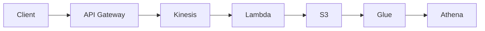

# Serverless Real-Time Data Ops

A portfolio adaptation of [AWS Serverless Data Pipeline by Terraform](https://github.com/gnokoheat/aws-serverless-data-pipeline-by-terraform), retained under the upstream MIT License. The repository is used to discuss an AWS event-processing path from intake through analytics.

## Architecture in scope



## What I changed for this portfolio

I removed unrelated Kubernetes templates and static credential placeholders. The root Terraform now accepts account and environment inputs through variables; `terraform.tfvars.example` shows the required non-secret fields.

## What to validate before an apply

- Authenticate with an approved AWS SSO/profile, workload role, or CI identity.
- Confirm the target account, region, resource names, retention settings, and IAM permissions.
- Review the plan in a disposable account; do not put access keys in `.tfvars`.

```bash
cp terraform.tfvars.example terraform.tfvars
terraform fmt -check -recursive
terraform init
terraform validate
terraform plan
```

See [`docs/DEPLOYMENT_GUIDE.md`](docs/DEPLOYMENT_GUIDE.md) for operational notes. The historical upstream README is retained in [`docs/UPSTREAM_README.md`](docs/UPSTREAM_README.md).
